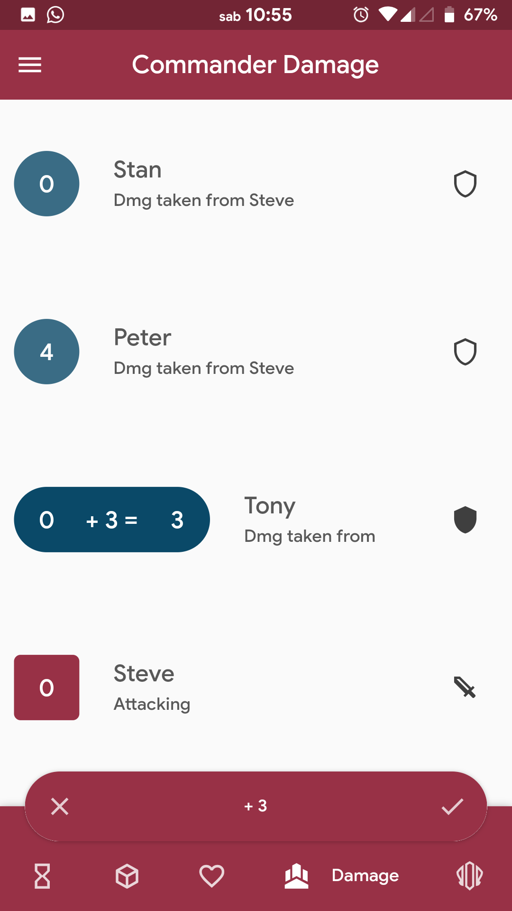

# [**CounterSpell**](https://play.google.com/store/apps/details?id=com.mvsidereusart.counterspell)
A life tracker app build with [Flutter](https://flutter.dev/) for Magic players, with a special focus on EDH / Commander functionalities.  
[Android](https://play.google.com/store/apps/details?id=com.mvsidereusart.counterspell)
[iOS](https://itunes.apple.com/us/app/counterspell/id1459235508?l=it&ls=1&mt=8)

### Who made it
I play Magic since I was a kid and especially Commander for the past five years. I never found a life counter app that suited all my needs and especially none that were made with Material Design in mind. I decided to learn mobile development and make what I wanted myself, and Flutter was the most obvious choice since it is multiplatform and easy to learn for someone that know a bit of object oriented programming but never dived into mobile development.

# What makes CounterSpell different

**Scrolling:** You won't find any +1/-1, +5/-5 button in CounterSpell. Every edit on a life total or any other quantity is made by scrolling on it to set a positive or negative increment. The starting life, the increment and the result are showed until you let go the scroll and wait a customizable delay time (so you can scroll multiple times to set a specific increment) or manually confirm the edit.

screenshot

**History:** A detailed screen dedicated to show you every past edit, and an "undo" / "redo" functionality.

screenshot

**Multi selection:** You can tap on a player to select it for a given edit and then scroll on a different player (or on one of the already selected ones) to make a group-edit all at once. This is especially useful when you need to ping all of your opponents for few damages without wasting time making 3 different edits. Also, those edits are all grouped in one action so the history doesn't get cluttered.

screenshot  screenshot

**Commander Damage:** You can tap on one player to set it as the attacker and then scroll on another player (or the same one, if your game is getting crazy enough) to edit the amount of commander damage that his commanded dealt to that player.

>You can also split the commander of a player into two partners and separately track their damages and their casts.

**Any kind of counter:** You can track poison counters, experience counters, and a lot of other stuff separately in the "Counter" section.

screenshot screenshot

**A lot of other stuff:** Really, this readme is getting too long.

>This app is intended to be used by one person at a time, that tracks all the relevant information on his phone and hands it around the table when needed. It's not the way everyone likes to use such an app and that's unserstandable, it's just the way I'm used and comfortable to with my playgroup. This isn't intended to be the perfect app for everyone and forever, improvement and competition are key to make the better producs for anyone.

>**Note:** This app is OpenSource and basically free. 
>The only paid feature in it is the Theme Engine, any MtG-related feature is free.
>CounterSpell is unofficial Fan Content permitted under the Fan Content Policy. Not approved/endorsed by Wizards. Portions of the materials used are property of Wizards of the Coast. ©Wizards of the Coast LLC.

